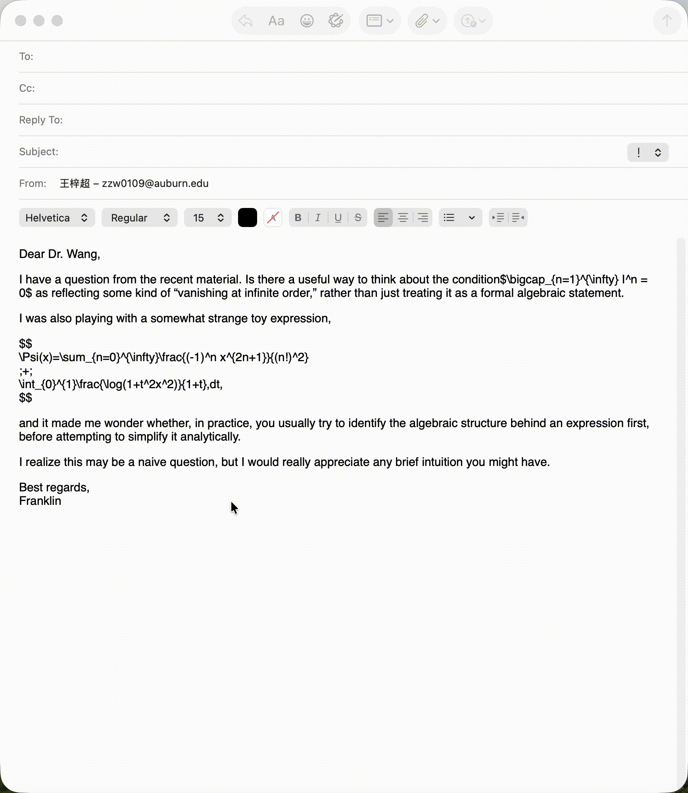

# ∑ Taxmail

**English** | [中文](README_CN.md)

**Render LaTeX formulas for email — select, press shortcut, done.**

Write math in plain text with `$...$` or `\[...\]`, select it, and Taxmail replaces the formulas with beautifully rendered images. Paste into any email client — Gmail, Apple Mail, Outlook — and your recipient sees real math, not code.

## How to Use



## Install

```bash
curl -fsSL https://raw.githubusercontent.com/Franklinwang72/taxmail/main/install.sh | bash
```

This installs Taxmail to your Desktop. Double-click to launch.

### Requirements

- **macOS 13+** (Ventura or later)
- **Python 3.10+** — `brew install python@3.12`
- **Xcode Command Line Tools** — `xcode-select --install`
- **TeX** *(optional, for complex formulas)* — `brew install --cask mactex-no-gui`

## Usage

### Method 1: Shortcut (recommended)

1. Write text with LaTeX formulas in any app
2. **Select the text**
3. Press **⌘⇧L** (customizable in Settings)
4. Formulas are rendered and replaced in-place

### Method 2: Clipboard

1. **Copy** text with LaTeX formulas (⌘C)
2. Click **Convert Clipboard** in the Taxmail window
3. **Paste** into email (⌘V)

### Method 3: Right-click

1. Select text → **Right-click** → **Services** → **Taxmail**

## Supported LaTeX Syntax

| Delimiter | Type | Example |
|-----------|------|---------|
| `$...$` | Inline | `$x^2 + y^2 = r^2$` |
| `\(...\)` | Inline | `\(E = mc^2\)` |
| `$$...$$` | Display | `$$\int_0^\infty e^{-x} dx$$` |
| `\[...\]` | Display | `\[\sum_{n=1}^{\infty} \frac{1}{n^2}\]` |

### Rendering engines

- **matplotlib** (built-in) — handles common math: fractions, integrals, Greek letters, subscripts
- **xelatex** (auto-detected) — full LaTeX support including `amsmath`, `tikz-cd`, CJK text, `\begin{cases}`, matrices

If TeX is installed, Taxmail automatically falls back to it for formulas matplotlib can't handle.

## Settings

The Taxmail window lets you:

- **Change shortcut** — click "Change", press your preferred key combo
- **Set formula size** — match your email font size (e.g., 12pt, 14pt, 16pt)

Settings are saved to `~/.config/latex2clip/config.toml`.

## Configuration

```toml
# ~/.config/latex2clip/config.toml

[hotkey]
key = "L"
modifiers = ["cmd", "shift"]

[render]
engine = "auto"        # auto | matplotlib | latex
dpi = 300
font_size_pt = 14.0
fg_color = "#000000"
bg_color = "#FFFFFF"

[output]
inline_height_em = 1.4
html_font_size_px = 14

[advanced]
fallback = true
timeout_seconds = 10
max_formulas = 50
```

## Architecture

```
┌─────────────────────────────────┐
│  Swift App (UI + global hotkey) │
│  ┌───────────┐  ┌────────────┐ │
│  │ SwiftUI   │  │ Carbon     │ │
│  │ Settings  │  │ Hotkey     │ │
│  └───────────┘  └─────┬──────┘ │
│                       │        │
│            subprocess │        │
│                       ▼        │
│  ┌─────────────────────────┐   │
│  │  Python Engine          │   │
│  │  parser → renderer →    │   │
│  │  composer → clipboard   │   │
│  └─────────────────────────┘   │
└─────────────────────────────────┘
```

- **Swift** handles the native macOS UI, menu bar icon, global hotkey registration, and Accessibility permissions
- **Python** handles LaTeX parsing, formula rendering (matplotlib/xelatex), HTML composition, and clipboard management

## Update

```bash
cd ~/.taxmail && git pull && ./build_app.sh
```

## Uninstall

```bash
rm -rf ~/.taxmail ~/Desktop/Taxmail.app ~/.config/latex2clip
```

## Email Client Compatibility

| Client | Status | Notes |
|--------|--------|-------|
| Gmail (Chrome) | ✅ | Uses HTML with base64 images |
| Apple Mail | ✅ | Uses RTFD with embedded images |
| Outlook (web) | ✅ | Works with inline images |
| Thunderbird | ✅ | Uses HTML |

## License

MIT
